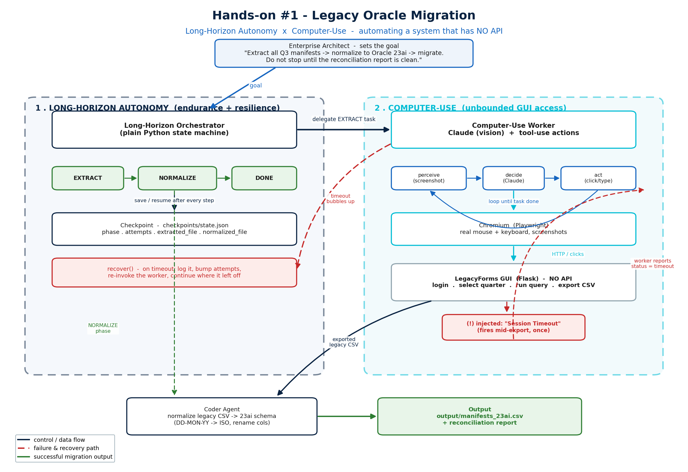

# Hands-on #1 — Legacy Oracle Migration

### Long-Horizon Autonomy × Computer-Use, on a system that has *no API*

This practical turns the *Inflection Point* example from the course into a small, runnable system you can drive yourself. The goal is not to write a clever agent — it is to **feel**, in your own terminal, why the combination of **Long-Horizon Autonomy** and **Computer-Use** is the inflection point that lets agents finally automate the messy long tail of legacy IT.

> If you have not read it yet, skim the *"The Inflection Point: Long-Horizon Autonomy & Computer-Use"* section of [2- Enhanced Agentic AI.pdf](2-%20Enhanced%20Agentic%20AI.pdf) first — this hands-on is the literal scenario described there.

---

## The scenario you are automating

You are migrating **20 years of supply-chain manifests** from a legacy **Oracle 8i** environment up to a modern **Oracle 23ai** infrastructure.

The legacy system has the properties that make this hard:

- It sits behind a Citrix-style terminal and exposes an old **Oracle Forms GUI** — no REST API, no webhooks, no export endpoint.
- The only way to get data out is the same way a human analyst would: **log in, choose a quarter, run the query, click Export.**
- It is unreliable — sessions time out without warning, and a single "Session Timeout" pop-up will crash any rigid RPA script written against it.

The mandate from the architect is **one sentence**:

> *"Extract all Q3 supply chain manifests, normalize the schema to match the new Oracle 23ai standard, and execute the migration. Do not stop until the reconciliation report is clean."*

That is the only instruction the system is given. Everything else — the click order, the recovery, the schema rewrite — it figures out.

---

## What you will learn (the *feel*, not the code)

After running this end to end, you should be able to answer these without notes:

1. **Why "computer-use" is *not* just RPA with extra steps.** You will watch the agent re-read the screen after every action and adapt — vs. an RPA script that breaks the moment a button moves.
2. **What "long-horizon autonomy" actually buys you.** You will trigger a mid-run failure (a forced session timeout). A rigid pipeline would die on Monday morning. The orchestrator will checkpoint, recover, log back in, and finish — *unattended*.
3. **Why you need *both*.** Computer-use alone gets you reach but no resilience. Long-horizon alone gets you persistence but no way into systems without APIs. The two together are what makes the legacy long tail addressable.
4. **The production-developer concerns** that come straight at you the moment this stops being a toy: scoped credentials, sandboxed browsers, action audit logs, human-in-the-loop gates on irreversible steps, and the *"API first, MCP server second, GUI agent last"* rule of thumb.

---

## Solution architecture

The full diagram and a step-by-step walkthrough live at [hands-on-1/architecture.pdf](hands-on-1/architecture.pdf). The short version:



Two cooperating capabilities, each owning one half of the problem:

**1 · Long-Horizon Autonomy (left, navy zone)** — the *endurance*.
- A plain-Python **Orchestrator** drives a state machine: **EXTRACT → NORMALIZE → DONE**.
- Every step is written to a **Checkpoint** (`checkpoints/state.json`) so the run survives a process kill and resumes where it left off.
- `recover()` owns the failure path: on a disruption it logs, bumps `attempts`, and re-invokes the worker.

**2 · Computer-Use (right, cyan zone)** — the *reach*.
- A **Worker** runs a **perceive → decide → act** loop: read screenshot, pick action, execute.
- It drives a real **Chromium** browser via Playwright — genuine clicks and keystrokes, no API calls.
- The target is a small **LegacyForms** Flask app standing in for the legacy Oracle Forms GUI. It is intentionally API-free.

**The disruption (red path).** Mid-export, the legacy system injects a one-time *"Session Timeout."* The worker reports `status = timeout`; the orchestrator's `recover()` catches it and re-invokes the worker, which logs back in and finishes the job.

**The output (green path).** Once EXTRACT succeeds, the **NORMALIZE** phase runs a small Coder Agent that converts the legacy CSV (rename columns, `DD-MON-YY → ISO` dates) into `output/manifests_23ai.csv` plus a **reconciliation report**.

---

## What you will build

Four parts, in build order:

| # | Component | Role | Lives in |
|---|-----------|------|----------|
| 1 | **LegacyForms GUI** (Flask) | The thing being driven. HTML forms only, no API. Has an injectable session timeout. | `hands-on-1/legacy_app/` |
| 2 | **Computer-Use Worker** | Playwright + Claude (vision). Perceive→decide→act loop. Returns `status = success / timeout`. | `hands-on-1/agent/` |
| 3 | **Long-Horizon Orchestrator** | Python state machine + JSON checkpoint + `recover()`. Owns the *goal*, not the clicks. | `hands-on-1/orchestrator/` |
| 4 | **Coder step (NORMALIZE)** | Reads the exported legacy CSV; writes 23ai-schema CSV + reconciliation report. | `hands-on-1/orchestrator/coder_step.py` |

The split is intentional and worth absorbing: **the worker has no idea what the goal is**, and **the orchestrator has no idea how to click a button**. They communicate through a tiny status contract. That separation is what makes the system survive a timeout — the worker returns *failure*, the orchestrator owns *what to do about it*.

---

## Two ways to run it

The build supports two modes. They are **identical from the user's perspective** — same legacy app, same orchestrator, same checkpoint logic — only the *decide* step changes.

| Mode | What replaces the *decide* step | Needs an API key? | Cost | When to use it |
|------|---------------------------------|-------------------|------|----------------|
| **Mock** | A deterministic Python policy that knows the LegacyForms app's flow. | No | Zero | Class machines without keys; running the demo offline; lecture replay. |
| **Live** | **Claude** with vision (the screenshot) + tool-use (click / type / select / finish). | Yes (`ANTHROPIC_API_KEY`) | A few cents per full run | Showing real model-driven control; demonstrating how the agent recovers from an unexpected timeout *without* having seen one before. |

Both modes hit the same legacy app, take the same screenshots, trigger the same forced timeout, and emit the same reconciliation report. Mock proves the *architecture* works; Live proves the *agent* does.

---

## Setup

Python 3.10+, Windows / macOS / Linux. From the repo root:

```bash
cd hands-on-1
python -m venv .venv
.\.venv\Scripts\activate           # PowerShell: .venv\Scripts\Activate.ps1
pip install -r requirements.txt
playwright install chromium        # first time only, ~150 MB
```

For **Live mode** only:

```bash
copy .env.example .env             # then edit .env, set ANTHROPIC_API_KEY=sk-...
```

---

## Running the demo

Once the build is complete you will have one entrypoint:

```bash
# Terminal 1 — start the legacy GUI
python -m legacy_app.app

# Terminal 2 — run the orchestrator (mock mode by default)
python -m orchestrator.run                  # mock
python -m orchestrator.run --live           # Claude-driven
python -m orchestrator.run --reset          # wipe checkpoint + legacy timeout flag
```

What you should see, in this order:
1. Chromium opens, you watch the worker log in, pick **Q3**, run the query, and click **Export**.
2. The forced timeout fires; the worker reports `status = timeout` and exits.
3. The orchestrator logs the failure, writes the checkpoint, and re-invokes the worker.
4. The worker logs back in and completes the export.
5. The Coder step normalizes the CSV and prints the reconciliation report.
6. `output/manifests_23ai.csv` and `output/reconciliation.txt` appear.

If you kill the orchestrator with `Ctrl+C` at any point and re-run it, it picks up from the last checkpoint — that is the long-horizon resilience guarantee in action.

---

## What to discuss in class (after running it)

- **Where would you put a human-in-the-loop gate**, and why? (Hint: the *write* side of NORMALIZE, not the read side of EXTRACT.)
- **What is the smallest credential scope** this agent could have? Could the legacy account be read-only? Could the export be staged through a separate identity?
- **How would you audit this run** if someone asked *"prove you didn't change a single row"* a quarter later? What gets logged, where, for how long?
- **Where does this approach break?** What if the legacy system asks for a 2FA code? Captures a CAPTCHA? Locks the account after N failed logins? Map each failure mode to a control.
- **API first, MCP second, GUI agent last** — what would it take to retire the GUI agent here? Is there a path to a thin export API on the legacy side? At what point is *that* cheaper than keeping the agent?

---

## The strategic takeaway

The **computer-use** agent provided the **unbounded access** (manipulating a legacy GUI with no API). **Long-horizon autonomy** provided the **endurance and resilience** (running unattended and recovering from a timeout). Together, they let teams automate the messy, unstructured *long tail* of legacy IT operations — freeing human capital for strategic work, not manual data investigation.

> **Build order:** legacy GUI app → computer-use worker → long-horizon orchestrator (checkpoint + recover) → coder/normalize step. The mock policy lets the whole demo run without an API key; flip to `--live` to swap in Claude for the *decide* step.
